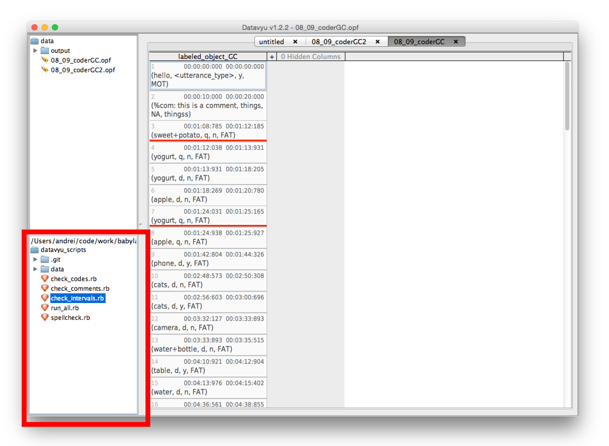

#datavyu scripts

This repository contains a collection of ruby scripts that check to see if Datavyu entries are properly formatted. You should clone this repository to the local machines and select its folder as the destination to look for scripts from within Datavyu (Script -> Set Favorites Folder).

##running

Each script has a variable named "column" which should be adjusted by hand when running. For example (from check_codes.rb):


```ruby
begin

	column = "labeled_object_GC"	# set this as necessary


	# checkValidCodes() makes sure that all the codes found in each cell of
	# the selected column are valid codes for that specific element. The
	# function is called with the value of the "column" variable defined above.
	# You need to change this by hand every time you run it on a different column.

	checkValidCodes(column, "",
				"utterance_type", ["q", "d", "i", "u", "r", "s", "n"],
				"object_present", ["y", "n"])
```

You should run these scripts once you've finished coding. They're separated into 3 distinct programs with multiple checks per script:

1. check_codes.rb
  * entered values are one of the predefined codes
  * speaker code is exactly 3 letters long
  * none of the codes are empty
2. check_comments.rb
  * all of the non-comment codes are "NA"
  * offset and onset are equal
3. check_intervals.rb
  * all onsets come prior to offsets

You can run them by double clicking their names in the bottom left corner in Datavyu.



